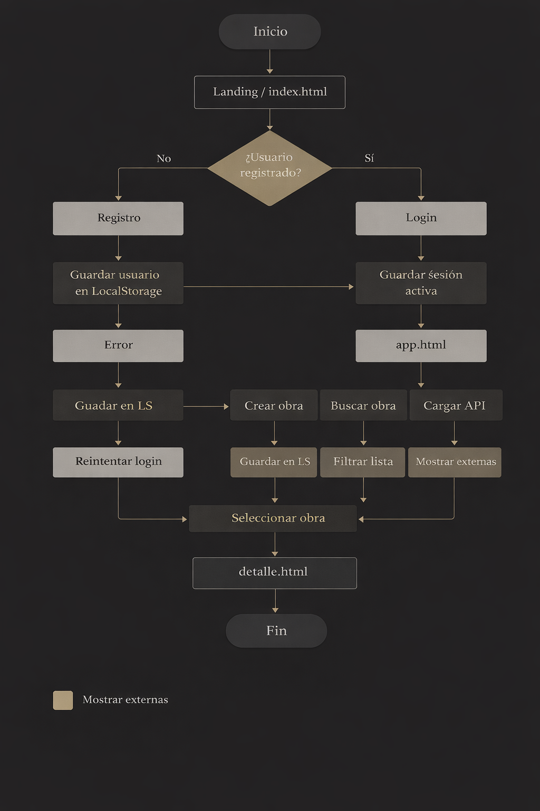

# MUSA

Plataforma web de gestión de obras de arte

---

## Descripción

MUSA es una aplicación web que permite gestionar, visualizar y explorar obras de arte.
El proyecto está inspirado en la estética de los museos digitales, combinando una interfaz cuidada con funcionalidades prácticas como autenticación de usuarios, creación de obras y consumo de datos externos.

---

## Funcionalidades

* Registro y login de usuarios
* Gestión de sesión activa
* Creación y almacenamiento de obras
* Visualización en galería
* Buscador de obras
* Carga de obras desde API externa
* Vista detallada de cada obra
* Diseño responsive

---

## Tecnologías utilizadas

* HTML5
* CSS3
* JavaScript (ES Modules)
* LocalStorage

---

## Instalación

Clonar el repositorio:

```bash
git clone git@github.com:Jeffersonfferss/Musa-.git
cd musa
```

---

## Ejecución

Opción recomendada:

* Abrir el proyecto en Visual Studio Code
* Usar la extensión Live Server
* Ejecutar `index.html`

Opción alternativa:

* Abrir directamente `index.html` en el navegador

---

## Estructura del proyecto

```
MUSA1/
│
├── index.html
├── app.html
├── README.md
├── LICENSE
├── .gitignore
│
├── /css
│   └── styles.css
│
├── /html
│   ├── login.html
│   ├── registro.html
│   ├── perfil.html
│   ├── detalles.html
│   └── info.html
│
├── /js
│   ├── app.js
│   ├── auth.js
│   ├── storage.js
│   ├── api.js
│   ├── ui.js
│   ├── clases.js
│   ├── login.js
│   ├── registro.js
│   ├── perfil.js
│   └── detalles.js
│
└── /.vscode
```

---

## Sistema de usuarios

La aplicación gestiona usuarios en el lado del cliente mediante LocalStorage:

* Registro de nuevos usuarios
* Inicio de sesión
* Persistencia de sesión activa
* Control básico de acceso a páginas

Este sistema es adecuado para un proyecto frontend, aunque no sustituye una solución con backend.

---

## Organización del código

El proyecto está dividido en módulos JavaScript para facilitar su mantenimiento:

* **auth.js** → gestión de autenticación
* **storage.js** → acceso a localStorage
* **api.js** → consumo de datos externos
* **ui.js** → manipulación del DOM
* **app.js** → lógica principal
* Archivos específicos (`login.js`, `registro.js`, etc.) → control de cada vista

---

## Objetivo del proyecto

Desarrollar una aplicación web completa aplicando:

* Estructuración modular del código
* Manipulación dinámica del DOM
* Persistencia de datos en cliente
* Diseño coherente y limpio

---

## Flujo de la aplicación



  Explicación del flujo
* El usuario accede a la página principal (landing).
* Puede registrarse o iniciar sesión.
* Si el login es correcto, se guarda la sesión en LocalStorage.
* Accede al panel principal (app.html).
* Desde ahí puede:
* * Crear nuevas obras
* * Buscar obras existentes
* * Cargar obras desde una API externa
* Puede acceder al detalle de cada obra.
* Finalmente, puede cerrar sesión y volver al inicio.

---

## Mejoras futuras

* Implementación de backend
* Autenticación segura
* Base de datos
* Sistema de favoritos
* Filtros avanzados

---

## Autor

Jefferson Aguilar

---

## Licencia

Proyecto de uso académico.
